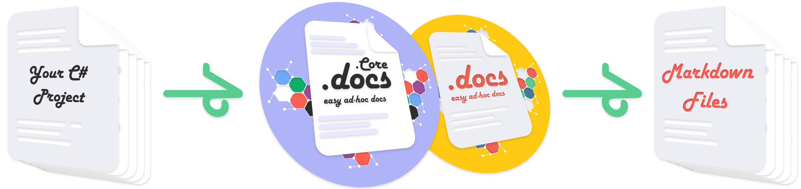

**This was an experimental library that is no longer maintained and has been replaced by [DotDocs](https://github.com/Chase-William/DotDocs).**

<p align="center">
  
</p>

# DotDocs *(.Docs)*

DotDocs is an intuitive & reliable documentation generator library for C# projects. Currently it produces markdown files as documentation and support for website generation is planned.

> DotDocs caters to C# and has no plans to expand to other languages. I am not satisfied with the current documentation generation tools available for the C#/.NET community. Therefore, I am building my own for the community, so enjoy! 😊

**Checkout my blog post where I describe the future plans for .Docs [here](https://www.chase-william.com/blogs/dotdocs).**

Take your C# project and create configurable markdown documentation!



> DotDocs will include all local projects your main project depends on.

## Installation Guide

> **Makes sure you have the .NET 6.0 runtime installed on your machine for DotDocs to work.**

### Through Chocolately *(recommended)*

Download DotDocs through chocolately using the command below:

```sh
# Administrator Rights Required
choco install dotdocs --pre 
```

### Directly From Github

Download and unzip the latest release from [here](https://github.com/Chase-William/.Docs/releases/).

Then configure your environment variables for *dotdocs.exe* and you're set.

## Usage Options

```sh
# Provide a path to a specific .csproj
# Provide a location for docs to be put
dotdocs "<path-to-project-file>.csproj"
```

```sh
# Provide a path to a specific .csproj
# Provide a location for the documentation to be put (.Docs will create a folder if needed)
# Provide a configuration file
dotdocs "<path-to-project-file>.csproj" -o "<output-folder-path>" -c "<config-file>.json"
```

### Examples

Want to see an example? Either checkout the latest example in [releases](https://github.com/Chase-William/.Docs/releases). or check the `.docs/` directory on this page!

Checkout the wiki for more information! ☕
